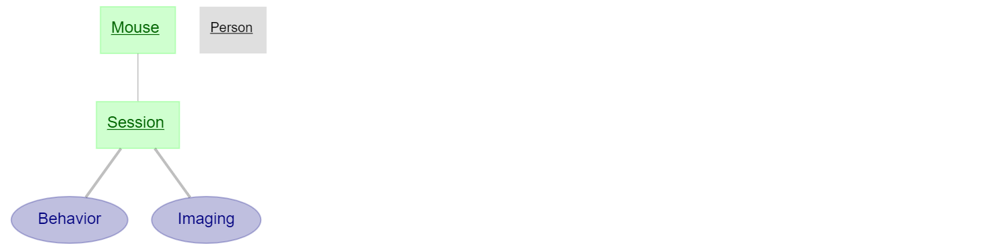

## Current schema (conrad_schema)

This pipeline involves performing behavioral research on mice while imaging neurons, then automatically processing the data. The pipeline begins with manually recording metadata on each mouse as described below in the `Mouse` table. Each behavioral experiment is overseen by an experimenter who's name is also manually recorded. During the actual experiment, the mouse is hooked up to a two-photon microscope and movies are taken and recorded along with relevant behavioral information in the `Session` table. 

The remaining `Behavior` and `Imaging` tables perform automatic processing on all previous tables using Datajoint's populate functionality. A series of functions are called to analyze the data and store experimentally relevant information including segmented regions of interest, extracted calcium imaging signals, and statistics of the mouse's licking behavior.

## Table fields

- Mouse
  - dob                  : date                         # Date of birth
  - iacuc_barcode        : bigint unsigned              # The IACUC barcode on the cage
  - sex="M"              : enum('M','F')                # The mouse gender
  - genotype="C57/Bl6"   : varchar(1000)                # The mouse strain

- Person
  - full_name            : varchar(30)                  

- Session
  - path_to_tiff         : varchar(1000)                # Two photon tiff file
  - path_to_adi          : varchar(1000)                # Labchart file with behavioural data
  - adi_trial_num        : tinyint                      # The session number in the adicht file associated with this session
  - session_date         : date                         # The date of the session
  - type                 : enum('naive','fbd1','fbd2','post') # The type of experimental trial
  - notes                : varchar(10000)               # Notes for the session

- Behavior
  - lick_freq            : longblob                     # The frequency of licks (Hz)
  - ang_vel              : longblob                     # The angular velocity of running (deg/s)
  - t                    : longblob                     # The time from start of imaging session (s)

- Imaging
  - roi_img              : longblob                     # The ROI used for calculating the fluorescence traces
  - yfp                  : longblob                     # The YFP fluorescence trace (dF/F)
  - cfp                  : longblob                     # The CFP fluorescence trace (dF/F)
  - fret                 : longblob                     # The FRET signal (dR/R = yfp/cfp - 1)
  - thresh               : longblob                     # The reward threshold for the FRET signal
  - t                    : longblob                     # The time from the start of the imaging session
  - si                   : longblob                     # The scanimage property structure
