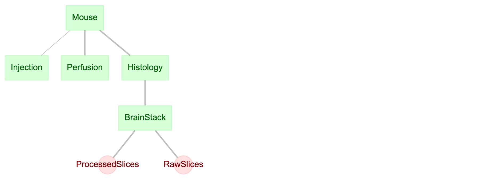

## Schema Description (common_atlas_v3)

This directory holds the master copy of the schema for the Orofacial project. [ Yoav Freund october 2019]

Pipeline begins with relevant mouse metadata and a single key as the name. Each mouse can have multiple injections, and finally a single perfusion before the brain is extracted. The Histology field contains information about the slices made into the brain. These tables concern the preparation of the physical brain and the fields are agreed upon by those who actually prepare the brains, overseen by Beth Friedman. These tables all require manual input.

The following "BrainStack" table, and subtables "RawSlices" and "ProcessedSlices" encompass the computational side of the pipeline. "BrainStack" contains all needed metainformation on a stack before being entered into the atlas pipeline. The slice subtables contain information on where image files are stored on my butt for easy retrieval.

[Link](https://github.com/ActiveBrainAtlas/Datajoint_Interface/blob/master/project_schemas/atlas_schema/atlas_schema.py) to the code where the tables are defined.

## All current stacks

Information on how to access all tables in the database as well as download all images from AWS S3 can be found [in this Jupyter Notebook.](https://github.com/ActiveBrainAtlas/Datajoint_Interface/blob/master/project_schemas/atlas_schema_python/Accessing%20Atlas%20Data_v2.ipynb)

Entries in all tables can be easily viewed by registered users using [Helium](http://ucsd-demo-helium.datajoint.io/login?from_user=alex&from_host=ucsd-demo-db.datajoint.io&from_path=%2Ftables%2Fcommon_u19_database%2Fbrain) hosted at `ucsd-demo-db.datajoint.io`.

## Table fields (as of v2)

- Mouse
  - date_of_birth  : date          # (date) the mouse's date of birth
  - sex            : enum('M','F') # (M/F) either 'M' for male, 'F' for female
  - genotype       : varchar(10)   # (Str) indicating the genotype
  - weight         : double        # (int) weight of the mouse in grams. -1 if unknown
  - bred           : varchar(20)   # (Str) Vendor where the mouse was bred (bred in house, purchased by vendor)

- Injection
  - injection_date  : date          # (date) what day was the injection performed
  - injection_type  : varchar(30)   # (Str) what kind of tracer/injection (flourescent?)
  - injection_length: int           # UNSURE. Assumed: the length of time the virus was allowed to propagate
  - assessment=''   : varchar(1000) # (Str) qualitative assessment of injection
    
- Perfusion
  - injection_date  : date          # (date) what day was the injection performed
  - post_fixation_condition_hours : int   # (int) How long kept in fix (overnight)
  - date_frozen    : date     # (date) The date the brain was frozen
  - date_sectioned : date     # (date) The date the brain was sectioned
  - injection_type  : varchar(30)   # (Str) what kind of tracer/injection
  - perfusion_lab   : varchar(30)   # (Str) Which lab perfused the mouse? This lab also kept the mouse
  - assessment=''   : varchar(1000) # (Str) optional, qualitative assessment of injection

- Histology
  - region         : varchar(10)    # (Str) ?
  - thickness      : int            # (int) thickness of each slice in microns
  - orientation    : enum('sagittal','coronal','horozontal')    # (Str) horizontal, sagittal, coronal
  - counter_stain  : varchar(30)    # (Str) what stain was used on the brain (thionin or NeuroTrace)
  - lab            : varchar(20)    # (Str) Which lab did the histology
  - series         : enum('all','every other','unknown') # Every section OR alternate sections

- BrainStack
  - stack_name       : varchar(10)   # (Str) unique designation for each mouse
  - num_slices       : int           # (int) total number of histology slices
  - num_valid_slices : int 
  - channels         : int           # (int) number of channels for each slice
  - sorted_filenames : varchar(50000)# (Str) the sorted_filenames.txt file for each brain
  - human_annotated  : boolean       # (bool) does this stack have human annotations
  - planar_resolution_um : double    # (double) 0.325 for AxioScanner, 0.46 from CSHL
  - section_thickness_um : double    # (double) typically 20um
  - unique index (stack_name)   # Adds constraint, stack name must be unique accross brains
  - __ProcessedSlices__
    - aws_bucket : varchar(40)     # (Str) the name of the bucket the files are stored on
    - raw_stack  : varchar(50000)  # (Str) a sequence of each filepath of files stored on S3 seperated by '|'
  - __RawSlices__
    - aws_bucket : varchar(40)     # (Str) the name of the bucket the files are stored on
    - processed_stack  : varchar(50000)  # (Str) a sequence of each filepath of files stored on S3 seperated by '|'
